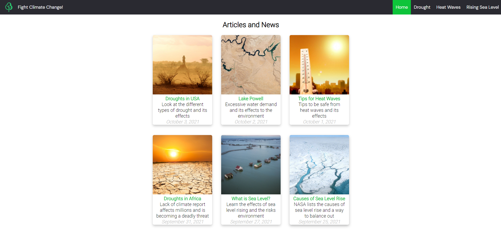

# Laboratory Exercise 1

HTML5 Website 

## Instructions

Create an HTML5 website using semantics and structure tags.

## Screenshot

**Submission Date:** Oct 5, 2021

**Due Date:** Oct 8, 2021

## Services and Software used

- Google fonts
- [Coolors.co][1]
- JetBrains Webstorm
- [icons8][2]
- Height Project Manager

[1]: (https://coolors.co)

[2]: (https://icons8.com)
